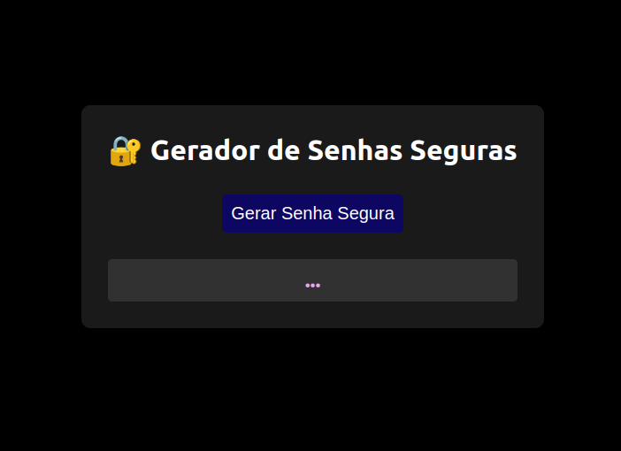

# Gerador de Senhas Seguras

[](LICENSE)

## Descrição

O Gerador de Senhas Seguras é um projeto que consiste em uma aplicação web simples para gerar senhas seguras. Ele utiliza algoritmos criptográficos avançados para criar senhas com alta entropia, garantindo melhor segurança para suas contas online.

## Tabela de Conteúdos

- [Funcionalidades](#funcionalidades)
- [Demonstração](#demonstração)
- [Pré-requisitos](#pré-requisitos)
- [Instalação](#instalação)
- [Como Usar](#como-usar)
- [Contribuição](#contribuição)
- [Licença](#licença)

## Funcionalidades

O Gerador de Senhas Seguras oferece uma série de funcionalidades para atender às suas necessidades para a geração de senhas seguras:

1. **Geração de senhas seguras**: Com apenas um clique no botão "Gerar Senha Segura", você pode obter uma senha forte e altamente segura. A aplicação gera automaticamente senhas aleatórias com 21 caracteres de comprimento, utilizando algoritmos criptográficos avançados. Essas senhas possuem alta entropia, o que significa que são extremamente difíceis de serem adivinhadas ou quebradas.

2. **Cópia automática para a área de transferência**: Após gerar a senha segura, você pode copiá-la facilmente para a área de transferência com um único clique. Isso evita a necessidade de selecionar e copiar manualmente a senha, proporcionando uma experiência mais conveniente e eficiente.

3. **Estilização moderna e responsiva**: A aplicação possui uma interface de usuário atraente e responsiva, que se adapta a diferentes tamanhos de tela e dispositivos. O design moderno e intuitivo torna o processo de geração de senhas mais agradável e fácil de usar.

Com essas funcionalidades, o Gerador de Senhas Seguras oferece uma solução simples e eficaz para criar senhas seguras, ajudando a proteger suas informações pessoais e contas online contra ataques de hackers e violações de segurança.

Você pode personalizar as configurações do gerador de senhas no arquivo `src/main.js` de acordo com suas preferências e requisitos específicos.

## Demonstração


*Captura de tela do Gerador de Senhas Seguras em ação*

## Pré-requisitos

- Node.js (v12 ou superior)

## Instalação

1. Clone o repositório em sua máquina local:

   ```shell
   git clone https://github.com/argemiroanjos/Secure-Password-Generator.git


2. Navegue até o diretório do projeto:
cd nome-do-repositorio


3. Instale as dependências do projeto:
npm install


## Como Usar

1. Inicie a aplicação localmente:
npm run dev


4. Abra o navegador e acesse a URL `http://localhost:3000`.

5. Clique no botão "Gerar Senha Segura" para gerar uma nova senha.

6. A senha gerada será exibida na tela. Clique na senha para copiá-la automaticamente para a área de transferência.

## Contribuição

Contribuições são bem-vindas! Se você encontrar algum problema ou tiver sugestões de melhorias, sinta-se à vontade para abrir uma nova issue ou enviar um pull request.

## Licença

Este projeto é licenciado sob a [Licença MIT](LICENSE).
